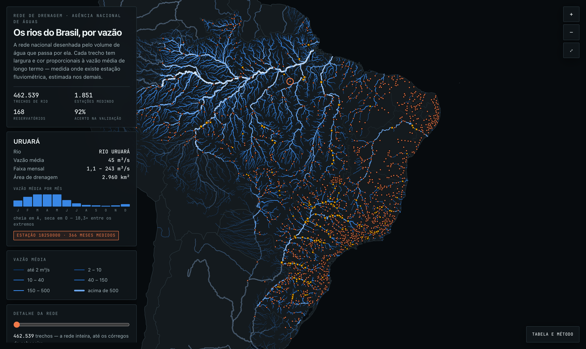

# Todos os rios do Brasil

Mapa interativo da rede de drenagem nacional desenhada pelo volume de água que passa por ela.
São **462.539 trechos de rio** — a Base Hidrográfica Ottocodificada da ANA inteira, do Amazonas
ao córrego de cabeceira — com a vazão média de longo termo de cada um: medida onde existe
estação fluviométrica, estimada nos demais.



Inspirado no [Elvestraum Noreg](https://norway-charts.netlify.app/river_flow_map/), que faz o
mesmo para os rios da Noruega a partir dos dados do NVE. A ideia de desenhar a rede pela vazão,
o painel lateral com a ficha do curso d'água e o fluxo animado vêm de lá; os dados, o método de
regionalização e o código são outros — aqui a direção do escoamento não é derivada do terreno,
ela vem pronta na topologia da base da ANA.

## O que dá para ver

- **Largura e cor de cada traço** proporcionais à vazão média, em escala logarítmica
- **Fluxo animado** correndo no sentido real do escoamento (opcional, desligado por padrão)
- **1.851 estações fluviométricas** com série longa, cada uma com o regime mês a mês —
  quando enche, quando seca e a razão entre os extremos
- **168 reservatórios** do Sistema Interligado Nacional, com 22 anos de operação diária:
  quanto passou pelas turbinas, quanto foi vertido, quanto chegou de montante
- **Controle de detalhe** para filtrar a rede por vazão mínima
- Passar o cursor acende o **rio inteiro**, não o trecho de poucos quilômetros

## A segunda página: os rios estão secando?

O mapa mostra a vazão **média**. Média não tem direção — uma estação estável e outra em queda
contínua há quarenta anos aparecem iguais se a média bater. `series.html` responde o que falta,
sobre a série histórica inteira da ANA: **4.218 estações, 1901 a 2026, 78.865 anos de medição**.

- **446 estações** com tendência comprovada — 359 em queda e 87 em alta — por Mann-Kendall
  com inclinação de Theil-Sen, em % da própria vazão média por década
- **530 mil dias de rio seco** registrados em 609 estações, um sinal que só existe na série
  diária: a média mensal de um rio que secou vinte dias e voltou é baixa, não é zero
- **Q7,10**, a vazão que rege a outorga de água no país, comparada entre 1961–1990 e 1994–2023:
  500 das 785 estações comparáveis entregam hoje menos no seu pior momento
- O **deslocamento do mês de cheia** entre as mesmas janelas, por média circular
- E a barra de erro de tudo isso: a ANA consistiu 2.026 estações em 2014 e **nenhuma** em 2025

**É seca ou é consumo?** Cruzando a tendência de cada rio com a tendência da chuva que cai sobre
ele — 69,8 milhões de leituras diárias de 5.389 pluviômetros — **196 dos 358 rios em queda
perdem água sem que a chuva tenha caído**: 167 com chuva estável e 29 com chuva subindo. Só 162
têm queda de chuva junto. A correlação entre as duas tendências é de apenas +0,32. O Jaguari, do
sistema Cantareira, perde 29,6% por década com a chuva parada em −0,1%; o Apodí-Mossoró perde
30,2% com a chuva **subindo** 8,5%.

Cruzar isso com as **outorgas de captação vigentes** do SNIRH não confirma a hipótese no
agregado — a licença mediana nos rios que perdem sem seca é de 1,6% da vazão média, *menor* que
os 3,3% dos que perdem com seca. O motivo é o dado: a captação vem sem coordenada, só com
município, e município grande mistura licenças de rios diferentes. Onde serve é caso a caso: o
São Desidério (BA) perde 25,6%/década com licença municipal de 314% da própria vazão, e o
Ribeirão do Feijão (SP), 5,4% com 71%. Não é prova de causa; é onde olhar primeiro.

**Duas janelas, de propósito.** A série mensal funde o arquivo histórico (1901 a agosto de 2023)
com o serviço SOAP da ANA e chega a maio de 2026 — é ela que sustenta as tendências, o calendário
da cheia e o tamanho da rede. A série **diária** existe só no arquivo e para em 2023, porque o
serviço devolve apenas agregado mensal; por isso os painéis de rio seco e de Q7,10 terminam
antes. Nada foi extrapolado para cobrir a diferença.

Quedas e altas não são o mesmo fenômeno em espelho. As quedas se concentram no semiárido e no
Sudeste sob estresse hídrico; as altas aparecem no arco de desmatamento do Maranhão, onde menos
floresta significa menos evapotranspiração e mais escoamento, e em bacias urbanizadas como o
Barigui em Curitiba e o Capivari em Campinas — mais asfalto, mais água chegando ao rio.

O ranking padrão exclui estações em barragem, açude ou canal: ali a "tendência" costuma ser a
data da obra, não o clima. A maior alta do país sem esse filtro era o Uruguai no barramento da
UHE Itá, com +70% por década, que é o enchimento do reservatório.

## De onde vem cada número

| Camada | Fonte |
|---|---|
| Rede de drenagem, área de drenagem, topologia | [Base Hidrográfica Ottocodificada 2017 (1:5.000)](https://dadosabertos.ana.gov.br), ANA |
| Vazões medidas (mapa) | Séries históricas das estações fluviométricas da ANA, 1995–2025 |
| Séries históricas (`series.html`) | [`anagovbr/hidro-dados-estacoes-convencionais`](https://github.com/anagovbr/hidro-dados-estacoes-convencionais) (1901–2023) fundido com o SOAP `HidroSerieHistorica` (até 2026-05) |
| Reservatórios | Sistema de Acompanhamento de Reservatórios (SAR), ANA |
| Contorno dos estados | `br_geobr_mapas` / IBGE |
| Terra e fronteiras | [Natural Earth](https://www.naturalearthdata.com) 1:50m |

## Como a vazão é estimada

Só 1.771 dos 462 mil trechos têm estação medindo. Nos demais:

1. Para cada estação com pelo menos cinco anos de dados, a vazão média de longo termo dividida
   pela área de drenagem dá a **vazão específica** daquele pedaço de bacia — no Brasil isso vai
   de menos de 1 L/s/km² na caatinga a cerca de 60 no litoral mais chuvoso.
2. Cada trecho recebe a vazão específica interpolada das oito estações mais próximas (média
   geométrica ponderada por 1/d²), aplicada **apenas à área que entra nele**.
3. Esse volume desce pela rede somando trecho a trecho até a foz, usando o campo `NUTRJUS`
   da BHO — a direção do fluxo não é inferida do terreno, ela já vem na base.
4. Onde uma estação mede o trecho, o valor medido substitui o acumulado e **vale para todo o
   curso a jusante**.

**Quanto erra:** retirando um quinto das estações, reestimando a rede sem elas e comparando nos
trechos que elas mediam, **92% das estimativas ficam dentro de 2×** do observado e 80% dentro de
1,5×, sem viés sistemático (mediana ×1,02). Contra vazões publicadas para os grandes rios:
Solimões 0,99×, Tapajós 1,02×, Xingu 0,96×, Amazonas 0,96×, Paraná 0,96×.

**Onde erra mais:** a estimativa ignora barragens, transposições e captações — no São Francisco
e no Paraná, fortemente regulados, o número se afasta do regime natural. E a rede cobre as bacias
inteiras, inclusive os trechos em território vizinho, onde não há posto brasileiro medindo: no
Uruguai e no Paraguai a vazão sai perto do dobro do publicado. Esses trechos aparecem esmaecidos
no mapa.

## Notas sobre a fonte

Duas coisas que valem saber antes de reusar a BHO:

- **A ordem de Strahler não é confiável fora do Brasil.** A base não mapeia as cabeceiras dos
  países vizinhos, então o Rio Salado argentino, com 286 mil km² de bacia, aparece com ordem 1.
  Por isso o filtro do mapa é por vazão, e a precisão da geometria segue a área de drenagem.
- **O nome do trecho às vezes é de um afluente pequeno.** No Paraná, o tronco principal aparece
  rotulado como "Córrego do Machado" por dezenas de quilômetros. A tabela dos 20 maiores rios
  ignora trechos nomeados como córrego ou baía.

## O pipeline

Os scripts em `pipeline/` reconstroem tudo do zero. A ordem:

```bash
cd pipeline
python3 baixa_rede.py 1          # rede BHO inteira (~460 mil trechos, ~20 min, 888 MB)
python3 baixa_vazao.py           # inventário fluviométrico + séries mensais (~35 min)
python3 baixa_reservatorios.py   # reservatórios do SAR + histórico de operação
python3 terra_fronteiras.py      # silhueta e divisas do Natural Earth
python3 baixa_outorgas.py        # outorgas de lançamento e captação do SNIRH (~2 min)
python3 baixa_atlas_esgotos.py   # Atlas Esgotos + sedes municipais, do espelho no beelink
python3 processa.py              # regionaliza a vazão, acumula o efluente e valida (~5 min)
python3 monta_pagina.py          # gera o index.html
```

Para mexer só na camada de poluição, sem refazer a regionalização inteira, `poluicao.py`
roda avulso sobre um `rede_vazao.json` pronto — ele reaproveita a geometria embutida no
próprio mapa e só precisa da topologia, que são 7 MB em vez de 888:

```bash
python3 baixa_topologia.py 1     # COTRECHO/NUTRJUS/COBACIA da BHO, sem geometria (~2 min)
python3 poluicao.py              # recalcula esg/ind/semDado no rede_vazao.json (~5 s)
python3 monta_pagina.py
```

E a página de séries históricas, que depende do ETL do arquivo da ANA já estar no data lake
(`rodado/scripts/scrap/ana_series_historicas.py`):

```bash
python3 analisa_tendencia.py     # Mann-Kendall + Theil-Sen + FDR -> tendencia.json
python3 prepara_paineis.py       # rio seco, cheia, Q7,10, tamanho da rede -> paineis.json
python3 monta_series.py          # gera o series.html (770 KB)
```

Uma armadilha da fonte, para quem for refazer: a ANA **esvaziou** o repositório
`hidro-dados-estacoes-convencionais` em dezembro de 2025 — um zip de `refs/heads/main` sai com
zero byte. O commit `b8b65b0` ainda carrega os 2,3 GB.

`contorno_uf.py` regenera `uf_linhas.json` a partir do DuckDB; o arquivo já vem versionado,
então só é preciso rodar se quiser trocar a base de contornos.

Dependências: `requests`, `polars`, `numpy`, `scipy`, `shapely`, `pyarrow`.

## Como a página cabe em 13 MB

São 2,6 milhões de vértices. Em JSON de inteiros isso daria 34 MB. Três medidas:

1. **Varint zigue-zague em base64** — 5 bits de dado por caractere, o sexto marca continuação.
   Mesma ideia do polyline do Google, com alfabeto que não precisa de escape em JSON.
2. **Duas grades de coordenada** — 11 m para rios com bacia acima de 500 km², 110 m para os
   menores, que já saem simplificados a centenas de metros.
3. **Simplificação escalonada pela área de drenagem** — de 20 m no Amazonas a 350 m nos córregos.

O resultado ainda é comprimido em gzip e descomprimido no navegador com `DecompressionStream`.

O render é Canvas 2D puro, sem biblioteca: a rede vai para um canvas fora de tela e só é
redesenhada quando a vista muda; a animação de fluxo tem canvas próprio por cima.

## Licença

Código sob MIT. Os dados são públicos, da ANA, do IBGE e do Natural Earth — cite as fontes.
